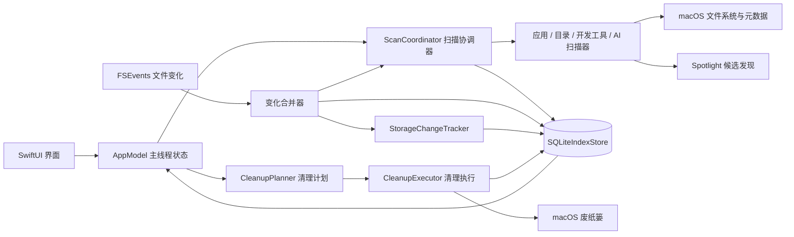
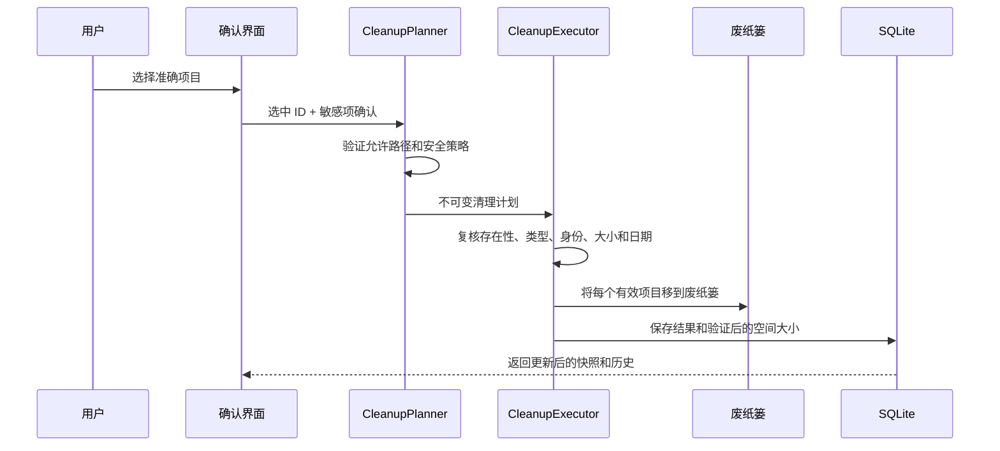

# 系统架构

## 整体结构

## Package 边界

### `SpacePilotCore`

保存纯模型和可测试的业务逻辑，包括扫描、应用身份和关联解析、储存持久化、AI/Plugin/Skill 发现、清理计划与执行、权限判断和界面投影。Core 代码不能依赖 SwiftUI。

### `SpacePilot`

可执行应用 Target。`AppModel` 负责协调异步任务，并在 MainActor 发布可观察状态。View 只渲染投影并发起操作，不能自行递归扫描文件系统，也不能在界面层实现所有权规则。

## 主要数据流

1. `SpacePilotRuntime.live()` 动态取得当前用户目录，并打开 `~/Library/Application Support/SpacePilot/index.sqlite`。
2. `AppModel` 首先加载最近的 `ScanSnapshot`，使界面无需等待新一轮完整扫描即可显示。
3. `ScanCoordinator` 根据任务执行 `applications`、`developerAI` 或 `full` 范围扫描。
4. 扫描器返回包含分配大小、所有权、风险和覆盖范围的模型。`SQLiteIndexStore` 原子保存最新完整快照，并同步所有权图和目录统计。
5. `StorageChangeTracker` 比较持久化基线与文件事件，记录新增、增长、删除和聚合变化；风险级别随基线与事件持久化，界面只把仍存在、未聚合且风险明确为 `safe` 的记录标为可安全清理。
6. `AppSnapshotProjection` 在 MainActor 外将快照转换为限制数量的界面投影，SwiftUI 只接收投影后的状态。
7. FSEvents 批量产生变化路径。`FileSystemChangeReconciler` 将受影响的目录统计标记为过期，并请求最小必要范围的后台刷新。
8. 用户选中应用后，可调用 `ApplicationDetailAnalyzer` 精确计算关联路径和大小；结果会缓存，不会在每次页面切换时重复计算。

## 储存容量口径

- `StorageProjection.categories` 只包含能映射到具体 `ScannedItem` 的真实分类，用于分类筛选和项目表格。
- `StorageProjection.capacityCategories` 在真实分类上补充已发现应用包，用于整盘分段容量条；其合计等于本地已分析空间。
- `unattributedBytes = max(0, usedBytes - analyzedBytes)`，表示未映射到可读索引路径的占用，可能包含 macOS 数据、快照、可清除空间和权限不可达目录。它不是一个可浏览、可清理的虚构分类。

## 最近空间变化

- `storage_change_states` 保存最近已知的文件元数据基线，不保存文件内容。
- `storage_change_events` 保存最多 31 天的变化记录；10 分钟内同一路径、同一类型的变化会合并。
- `disk_space_observations` 保存磁盘总容量与可用容量采样，用于把已追踪变化与整盘变化并列展示。
- 单文件变化达到 100 MiB 才单独展示；同一目录下更小的变化达到 100 MiB 后聚合展示；1 GiB 以上变化在界面强调。
- FSEvents 从持久化游标回放应用关闭期间的事件。`storage_change_gaps` 明确表示事件历史不可用或首次启用追踪前的空档；完整扫描重新校准基线并关闭开放缺口。

## 应用所有权模型

关联候选项可能来自准确 Bundle ID、容器 ID、嵌入组件、签名/Team 信息、Spotlight、版本化知识库，或当前用户临时区中与已签名 Bundle 命名空间精确匹配的一级项目。临时区发现只检查 macOS 为当前用户分配的 `C`、`T`、`X` 根目录，不递归扫描整个 `/private/var`。每条有效关联均记录：

- 证据和置信度；
- 应用专属或共享所有权；
- 清理风险；
- 对应的具体索引项目。

准确的结构化身份优先于名称相似度。有歧义的共享项或模糊结果可以展示供用户检查，但不能默认选中。

## AI 管理模型

已知工具定义和本地探测会生成只读 `AIToolRecord`。AI 应用、CLI 工具、Plugin 和 Skill 会投影到统一的“开发与 AI”工作区。产品族合并会把当前 ChatGPT 和 Codex 资产统一展示，同时保留底层真实路径和各自范围。

## 清理事务

Managed 资源会被拒绝。已经变化或不存在的文件会被跳过并记录原因，而不是强制删除。

## 并发与性能规则

- `AppModel` 运行在 MainActor；文件遍历、发现、投影和清理计划使用可取消的后台任务。
- 异步投影或发现只有最新一代任务可以发布结果。
- 快照必须压缩并限制项目数量，不能在界面模型中保留数百万个逐文件对象。
- `.app` 应用包和已知所有权根目录默认汇总统计，只有用户查看详情时才展开。
- Spotlight 只加速候选发现，不能作为完整性和目录大小的权威来源。
